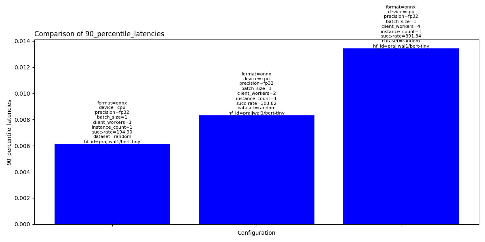

[](https://www.python.org)
[](https://github.com/psf/black)
[](https://github.com/legobench/huggingbench/actions/workflows/main.yml)

# HuggingBench

<div align="center">
    
</div>

<h3 align="center">Benchmark and experiment with ML model serving</h3>
<p align="center">Extensible open-source tool to easily benchmark models from <a link="https://huggingface.co"> HuggingFace </a></p> 

# 🤖 Introduction

HuggingBench is an extensible, open-source MLOps tool for experimenting around serving ML models from Huggingface. By running one command from terminal the tool generates various model serving configurations, deploys the model, performs load testing by sending inference requests and shows respective metrics upon completition. This should save time when looking for an optimal model serving cofiguration or just help with understanding latency/throughput and hardware needs for serving the model.

## 📝 Note

This was started as a hobby project to learn & explore various ML models and respective model servers. It is still in early days so might be 🐞.
We definitevly plan to improve the tool so please stay tuned. We are happy to get your feedback so feel free to report problems, wishes, etc..


# 📋 Requirements

Python 3.9 or 3.10 is required.

HuggingBench use Docker containers to run various inference servers so you should have Docker available
on your system.

* Instructions for installing Docker Engine on Ubuntu https://docs.docker.com/engine/install/ubuntu/
* Instructions for installing Docker Desktop on Mac https://docs.docker.com/desktop/install/mac-install/

## GPU support (optional)

To enable GPU acceleration for Docker containers running on NVidia GPU please follow the instructions
from here https://github.com/NVIDIA/nvidia-container-toolkit#getting-started


# 🏃 Quickstart

Note that currently the tool runs only locally meaning it runs on the system where the experiments are performed.

Clone the repo:

```git clone https://github.com/legobench/huggingbench.git```

Build all required Docker images used for converting and optimizing models:

```./docker/build-all.sh```

Create Python environment and activate:

```
python -m venv env
source env/bin/activate
```

Install dependencies and the project:

```pip install -e .```

Pull Nvidia Triton server Docker image used by the Triton Plugin:

```docker pull nvcr.io/nvidia/tritonserver:23.04-py3```

(NOTE: if you are running with GPU/CUDA you might want to make sure that your host intsalled CUDA drivers are compatible with the ones provided in the container)

Run command to see how client concurreny affects serving of HuggingFace model https://huggingface.co/prajjwal1/bert-tiny on NVidia Triton Inference server:

```hbench triton --hf_id prajjwal1/bert-tiny --client_workers 1 2 4```

Above command will generate 3 experiments: first with 1 concurrent client, then 2 and 4. Each experiment will spin
up a docker container with Triton server, deploy the model with the right configuration and generate the load
by sending inference requests. Upon completion metric table will be presented in the terminal along with the 
charts exported in JPEG. You can find the results below.

# 💡 How it works

**HuggingBench Design Principles**:

* **Extensibility**: Easily incorporate new model servers, model formats, optimization techniques, and workloads for evaluation and comparison, allowing for flexibility and inclusion of current and future industry options across different hardware.
* **Reproducibility**: Ensure that the benchmark can be reproduced reliably based on the provided specification.
* **Production-Fidelity**: Strive to closely replicate the production environment, encompassing workload generation, model optimization, and server configuration options within the benchmark


HuggingBench can be extended with an additional inference servers by implementing the Plugin. At the
moment NVidia Triton server is only supported but more are coming soon. We also encourage you to contribute
and help us make HugggingBench better (more on plugins [here](#plugins))!


Docker containers are used a lot to helps us avoid dependency hell: no need to manually
install the right depenendencies thus reducing the friction. Two main use cases covered by
Docker containers: (1) converting and optimizing the model (2) inference server for model serving.
Note that the actual model and it's configuration is stored on host disk under configured `workspace` 
folder and shared(bind) with respective Docker containers. 

## 🧩 Experiments

Here is a list of flags that can be passed in as command line arguments that are used to generate experiments
we want to benchmark:


| Flag             | Description                                                                                                    | Options               | Default |
| ---------------- | -------------------------------------------------------------------------------------------------------------- | --------------------- | ------- |
| `format`         | Model format to use.                                                                                           | onnx, trt, openvino   | onnx    |
| `device`         | Device model runs on.                                                                                          | cpu, gpu              | cpu     |
| `precision`      | Model precision.                                                                                               | fp32, fp16            | fp32    |
| `client_workers` | Number of concurrent clients sending inference requests                                                        | integer               | 1       |
| `hf_id`          | Hugging Face model ID. It needs to be public because we download the model from HuggingFace                    | eg. bert-base-uncased |         |
| `batch_size`     | Batch size for sending inference requests. Many model have max batch size of 4                                 | usually from 1 to 4   | 1       |
| `instance_count` | How many instances of ML model to create. More instances can help with throughput but require more HW resource | 1 or few              | 1       |

Experiments are cartesian product of all given CLI arguments. For example if we provide `--format onnx openvino` and `--client_workers 1 2 4` we will generate 6 experiments: [[onnx, 1], [onnx,2], [onnx,4], [openvino, 1], [openvino, 2], [openvino, 4]].

### 🏘️ Local models

In case you want to run model that is not available on HuggingFace Hub you can point the tool to a folder containing the model.
Model has to be in PyTorch format along with `config.json` file (https://huggingface.co/docs/transformers/main_classes/configuration , you can use HuggingFace librares to generate `config.json` from model). The `--task` must be given when using local models as it can not be infered.
Note that we also have to provide `--id` since we use it to generate unique model identifier when tracking metrics.

Here is an example of running experiments on a local model:

```hbench triton --id my-tiny-bert --model_local_path /home/unsigned/temp/tiny/ --task question-answering```


## 📊 Results


Here is an example of the output generated by running `hbench triton --hf_id prajjwal1/bert-tiny --client_workers 1 2 4`:


```
...
INFO:bench.exp_runner:Results written to temp/prajjwal1-bert-tiny.csv
+----------+----------+-------------+--------------+------------------+------------------+----------------+--------------+---------------------+------------+------------+-----------------+
| format   | device   | precision   |   batch_size |   client_workers |   instance_count |   success_rate | dataset_id   | hf_id               |        avg |     median |   90_percentile |
|----------+----------+-------------+--------------+------------------+------------------+----------------+--------------+---------------------+------------+------------+-----------------|
| onnx     | cpu      | fp32        |            1 |                1 |                1 |        194.897 | random       | prajjwal1/bert-tiny | 0.00503731 | 0.00498577 |      0.00612923 |
| onnx     | cpu      | fp32        |            1 |                2 |                1 |        303.824 | random       | prajjwal1/bert-tiny | 0.00648175 | 0.00627352 |      0.00832955 |
| onnx     | cpu      | fp32        |            1 |                4 |                1 |        391.341 | random       | prajjwal1/bert-tiny | 0.0100849  | 0.0096624  |      0.0134488  |
+----------+----------+-------------+--------------+------------------+------------------+----------------+--------------+---------------------+------------+------------+-----------------+
INFO:bench.chart:Saved chart to '/Users/niksa/projects/huggingbench/temp/triton/median_latencies.png'
INFO:bench.chart:Saved chart to '/Users/niksa/projects/huggingbench/temp/triton/90_percentile_latencies.png'
INFO:bench.chart:Saved chart to '/Users/niksa/projects/huggingbench/temp/triton/99_percentile_latencies.png'
INFO:bench.chart:Saved chart to '/Users/niksa/projects/huggingbench/temp/triton/throughputs.png'
INFO:bench.chart:Saved chart to '/Users/niksa/projects/huggingbench/temp/triton/avg_latencies.png'
```

Inference throughput (req/s):
 
")

Above chart is showing that by increasing concurrency on the client side we increase model serving throughput.

Inference latency p90:



Above chart is showing that increased client concurrency leads to increased latency which is expected
as more requests are served at the same time.

## 📈 Prometheus metrics

To provide better insight into benchmarks we collect metrics with Prometheus and use Grafana for charting.
We collect metrics from respective inference server (eg Triton) together with the metrics emitted by HuggingBench. Follow the instructions [here](./docker/observability/README.md) to setup benchmark `Observability` stack.
Grafana should be preloaded with pre-defined benchmark Dashboard.

Charts showing few metrics while benchmarking `bert-base-uncased` deployed on Triton and Mac M1:


## 🔌 Plugins

To be able to easily add more inference servers and compare across, HuggingBench uses Plugin architecture. Each inference server
becomes a plugin and needs to implement classes defined in [plugin.py](./src/bench/plugin.py). Check out [triton plugin](./src/plugins/triton/) for an example of plugin implementation.


# 📖 More Examples

## microsoft/resnet-50

Let's run benchmarks to figure out the best way to serve `resnet-50` with GPU on Triton server.

```
hbench triton --id microsoft/resnet-50 --device gpu --batch_size 1 4 --client_workers 1 4 --format onnx openvino trt
```

Notice that we passed in `openvino` as potential format but since we set `--device gpu` it will not run openvino benchmarks.

Below we can see results where we can see that TensorRT format performs a lot better then ONNX.  We can also see that smaller
batches and more concurrency result in more throughput.


```
+----------+----------+-------------+--------------+------------------+------------------+----------------+--------------+---------------------+------------+------------+-----------------+
| format   | device   | precision   |   batch_size |   client_workers |   instance_count |   success_rate | dataset_id   | hf_id               |        avg |     median |   90_percentile |
|----------+----------+-------------+--------------+------------------+------------------+----------------+--------------+---------------------+------------+------------+-----------------|
| onnx     | gpu      | fp32        |            1 |                1 |                1 |       155.25   | random       | microsoft/resnet-50 | 0.00638321 | 0.00485436 |      0.00512229 |
| onnx     | gpu      | fp32        |            4 |                1 |                1 |        57.6713 | random       | microsoft/resnet-50 | 0.0172525  | 0.0116182  |      0.0120003  |
| onnx     | gpu      | fp32        |            1 |                4 |                1 |       190.919  | random       | microsoft/resnet-50 | 0.0208571  | 0.0146834  |      0.0160036  |
| onnx     | gpu      | fp32        |            4 |                4 |                1 |        74.5767 | random       | microsoft/resnet-50 | 0.0532744  | 0.0301682  |      0.0315603  |
| trt      | gpu      | fp32        |            1 |                1 |                1 |       646.863  | random       | microsoft/resnet-50 | 0.00150038 | 0.00146858 |      0.00156489 |
| trt      | gpu      | fp32        |            4 |                1 |                1 |       206.389  | random       | microsoft/resnet-50 | 0.004778   | 0.00472103 |      0.00498765 |
| trt      | gpu      | fp32        |            1 |                4 |                1 |      1034.4    | random       | microsoft/resnet-50 | 0.00347166 | 0.00314214 |      0.00403697 |
| trt      | gpu      | fp32        |            4 |                4 |                1 |       276.856  | random       | microsoft/resnet-50 | 0.0130047  | 0.0132595  |      0.0149541  |
+----------+----------+-------------+--------------+------------------+------------------+----------------+--------------+---------------------+------------+------------+-----------------+

```

")

# 💁 Contributing

We value the assistance of the community in enhancing the HuggingBench platform! There are several ways you can contribute:

* If you come across any bugs, build issues, feature requests, or suggestions, please open an issue and let us know.
* Feel free to fork this repository and submit a pull request if you'd like to contribute code or make changes.

To ensure effective collaboration, we recommend initiating discussions about specific improvements on the GitHub issues page. It serves as the primary platform for discussing your proposed enhancements and their implementation with the core development team.

# 📜 License

HuggingBench is distributed under the terms of the Apache License Version 2.0. A complete version of the license is available in the LICENSE file in this repository.
