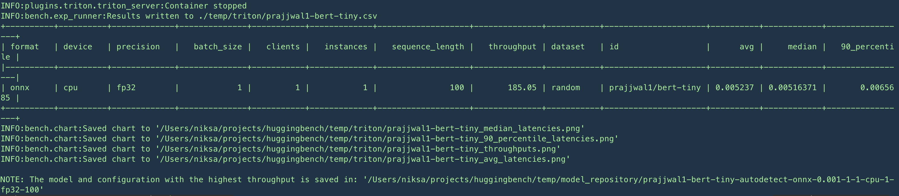

[](https://www.python.org)
[](https://github.com/psf/black)
[](https://github.com/legobench/huggingbench/actions/workflows/main.yml)

# HuggingBench

<div align="center">
    
</div>

<h3 align="center">Find the optimal HuggingFace model serving <br>🚧 Project is in Alpha stage 🚧</h3>


# 🤖 Introduction

HuggingBench is an extensible, open-source MLOps tool for benchmarking [HuggingFace models](https://huggingface.co/models) and finding the most optimal model serving. 
With just a single command, the tool generates multiple model serving configurations, deploys the model, performs load testing by sending inference requests, collects respective metrics and provides the most optimal model serving.

***👉 Check out [the blog post](https://medium.com/@niksa.jakovljevic/introducing-huggingbench-a-path-to-optimized-model-serving-a17cecc8d3ec) describing our journey and motivation behind creating HuggingBench 👈*** 

HuggingBench aims to make it easier and faster to find an optimal model serving configuration, while helping you better understand latency/throughput and hardware needs for serving the model. 


**HuggingBench Design Principles**:

* **Extensibility**: Easily incorporate new model servers, model formats, optimization techniques, and workloads for evaluation and comparison, allowing for flexibility and inclusion of current and future industry options across different hardware.
* **Reproducibility**: Ensure that the benchmark can be reproduced reliably based on the provided specification.
* **Production-Fidelity**: Strive to closely replicate the production environment, encompassing workload generation, model optimization, and server configuration options within the benchmark.

## 📝 About HuggingBench

This was started as a hobby project to learn & explore various HF models and respective model servers. It is still in early days and might be 🐞.
Please stay tuned as we continue to improve the tool. We are happy to get your feedback so feel free to report problems, wishes, etc..

## Current limitations

* Everything runs locally using Docker containers
* Accuracy checks are not performed on converted models
* No support for external dataset when calibrating models (overall calibration support is poor) 
* Models and configs are stored on a local drive
* Only supporting Nvidia Triton Inference Server
* PyTorch model needs to map to ONNX one to one (no support for model ensamble)

We are plannig to remove above limitations (not promissing it will happen 😄)

# 📋 Requirements

Python 3.9 or 3.10 is required.

HuggingBench uses Docker containers to run various inference servers so you should have Docker available
on your system.

* Instructions for installing Docker Engine on Ubuntu https://docs.docker.com/engine/install/ubuntu/
* Instructions for installing Docker Desktop on Mac https://docs.docker.com/desktop/install/mac-install/

## GPU support (optional)

Your host system must have CUDA drivers installed (https://docs.nvidia.com/cuda/cuda-installation-guide-linux/index.html)

To enable GPU acceleration for Docker containers running on Nvidia GPU please follow the instructions
from here https://www.ibm.com/docs/en/maximo-vi/8.3.0?topic=planning-installing-docker-nvidia-docker2#install_ub


## Mac M1/M2

CPU inference should work fine, however OpenVINO might not work.


# 🏃 Quickstart

Note that currently the tool runs only locally meaning it runs on the system where the experiments are performed.

Clone the repo:

```git clone https://github.com/legobench/huggingbench.git```

Build all required Docker images used for converting and optimizing models (NOTE: make sure that your current user is part of `docker` user group before running the script below: `sudo usermod -aG docker $USER`):

```./docker/build-all.sh```

Create Python environment and activate:

```
python -m venv env
source env/bin/activate
```

Install dependencies and the project:

```pip install -e . --extra-index-url https://pypi.ngc.nvidia.com```

Pull Nvidia Triton server Docker image used by the Triton Plugin:

```docker pull nvcr.io/nvidia/tritonserver:23.04-py3```

(NOTE: if you are running with GPU/CUDA you might want to make sure that your host installed CUDA drivers are compatible with the ones provided in the container. The container uses Nvidia 530.30 drivers. If you have Nvidia 
package repository added, to install compatible version on Ubuntu you can just run: `sudo apt install nvidia-driver-530`)

Run command to see how client concurrency affects serving of HuggingFace model https://huggingface.co/prajjwal1/bert-tiny on Nvidia Triton Inference server:

```hbench triton --id prajjwal1/bert-tiny --client_workers 1 2 4```

Above command will generate 3 experiments: first with 1 concurrent client, then 2 and 4. Each experiment will spin
up a Docker container with Triton server, deploy the model with the right configuration and generate the load
by sending inference requests. Upon completion, metric table will be presented in the terminal along with 
charts exported in JPEG. You can find the results below. In the example above the tool will automatically download
the model from HuggingFace Hub.

By default we run each load test for 150 seconds. To tweak this use env var `EXPERIMENT_RUN_INTERVAL` eg:

```EXPERIMENT_RUN_INTERVAL=30 hbench triton --id prajjwal1/bert-tiny```

Keep an eye on the console output to track the progress. Upon completion the summary is printed in the console:



If you want more detailed metrics on model performance check out the section on [Prometheus](#📈-prometheus-metrics) 

# 💡 How it works


HuggingBench can be extended with additional inference servers by implementing the Plugin. At the
moment, Nvidia Triton server is only supported, but more are coming soon. We also encourage you to contribute
and help us make HuggingBench better (more on plugins [here](#🔌-plugins))!


Docker containers are used a lot to help us avoid dependency hell: no need to manually
install the right dependencies thus reducing friction. Two main use cases covered by
Docker containers: (1) converting and optimizing the model (2) inference server for model serving.
Note that the actual model and it's configuration is stored on host disk under configured `workspace` 
folder and shared(bind) with respective Docker containers. 

## 🧩 Experiments

Here is a list of flags that can be passed in as command line arguments that are used to generate experiments
we want to benchmark:


| Flag             | Description                                                                                                    | Options               | Default |
| ---------------- | -------------------------------------------------------------------------------------------------------------- | --------------------- | ------- |
| `format`         | Model format to use.                                                                                           | onnx, trt, openvino   | onnx    |
| `device`         | Device model runs on.                                                                                          | cpu, gpu              | cpu     |
| `precision`      | Model precision.                                                                                               | fp32, fp16            | fp32    |
| `client_workers` | Number of concurrent clients sending inference requests                                                        | integer               | 1       |
| `id`             | Hugging Face model ID to download. For local models ID is used as unique model identfier.                      | eg. bert-base-uncased |         |
| `batch_size`     | Batch size for sending inference requests. Many model have max batch size of 4                                 | usually from 1 to 4   | 1       |
| `instance_count` | How many instances of ML model to create. More instances can help with throughput but require more HW resource | 1 or few              | 1       |
| `sequence_length` | The length of input sequence | Depending on the model              | 100       |

Experiments are cartesian product of all given CLI arguments. For example if we provide `--format onnx openvino` and `--client_workers 1 2 4` we will generate 6 experiments: [[onnx, 1], [onnx,2], [onnx,4], [openvino, 1], [openvino, 2], [openvino, 4]].

### 🏘️ Local models

In case you want to run model that is not available on HuggingFace Hub you can point the tool to a folder containing the model.
Current limitation is that the model has to be in PyTorch format that uses HF Transformers API (meaning your model is extending `PreTrainedModel` instead of `nn.Module`). The `config.json` file has to be present as well since `Optimum` library needs it (you can use HuggingFace libraries to generate `config.json` from the model). 
The `--task` must be given when using local models as it can not be inferred.
Note that we also have to provide `--id` since we use it to generate a unique model identifier when tracking metrics.

Here is an example of running experiments on a PyTorch model with Transformers:

```hbench triton --id my-tiny-bert --model_local_path /home/unsigned/temp/tiny/ --task question-answering```

NOTE: There is ongoing work to support not only PyTorch models that use Transformers API but any PyTorch or TensorFlow model.

## 📊 Results


Here is an example of the output generated by running `hbench triton --id prajjwal1/bert-tiny --client_workers 1 2 4`:


```
...
INFO:bench.exp_runner:Results written to temp/prajjwal1-bert-tiny.csv
+----------+----------+-------------+--------------+-----------+-------------+-------------------+--------------+-----------+---------------------+------------+------------+-----------------+
| format   | device   | precision   |   batch_size |   clients |   instances |   sequence_length |   throughput | dataset   | id                  |        avg |     median |   90_percentile |
|----------+----------+-------------+--------------+-----------+-------------+-------------------+--------------+-----------+---------------------+------------+------------+-----------------|
| onnx     | cpu      | fp32        |            1 |         1 |           1 |               100 |      191.992 | random    | prajjwal1/bert-tiny | 0.00510451 | 0.00505996 |      0.00635821 |
+----------+----------+-------------+--------------+-----------+-------------+-------------------+--------------+-----------+---------------------+------------+------------+-----------------+
INFO:bench.chart:Saved chart to '/Users/niksa/projects/huggingbench/temp/triton/median_latencies.png'
INFO:bench.chart:Saved chart to '/Users/niksa/projects/huggingbench/temp/triton/90_percentile_latencies.png'
INFO:bench.chart:Saved chart to '/Users/niksa/projects/huggingbench/temp/triton/99_percentile_latencies.png'
INFO:bench.chart:Saved chart to '/Users/niksa/projects/huggingbench/temp/triton/throughputs.png'
INFO:bench.chart:Saved chart to '/Users/niksa/projects/huggingbench/temp/triton/avg_latencies.png'
```

Inference throughput (req/s):
 
")

Above chart is showing that by increasing concurrency on the client side we increase model serving throughput.

Inference latency p90:


Above chart is showing that increased client concurrency leads to increased latency which is expected
as more requests are served at the same time.

## 📈 Prometheus metrics

To provide better insight into benchmarks we collect metrics with Prometheus and use Grafana for charting.
We collect metrics from respective inference server (eg Triton) together with the metrics emitted by HuggingBench. Follow the instructions [here](./docker/observability/README.md) to setup benchmark `Observability` stack.
Grafana should be preloaded with pre-defined benchmark Dashboard.

Charts showing few metrics while benchmarking `bert-base-uncased` deployed on Triton and Mac M1:


## 🔌 Plugins

To be able to easily add more inference servers and compare across them, HuggingBench uses Plugin architecture. Each inference server
becomes a plugin and needs to implement classes defined in [plugin.py](./src/bench/plugin.py). Check out [triton plugin](./src/plugins/triton/) for an example of plugin implementation.

Note that currently plugin requirements are added into project requirements. Project and plugin requirements will be separated in the future.

# 📖 More Examples

Blog posts:
*  [Optimizing Resnet-50: 8X inference throughput with just a few commands](https://medium.com/@niksa.jakovljevic/optimizing-resnet-50-8x-inference-throughput-with-just-a-few-commands-41fa148a25df)

## microsoft/resnet-50

Let's run benchmarks to figure out the best way to serve `resnet-50` with GPU on Triton server.

```
hbench triton --id microsoft/resnet-50 --device gpu --batch_size 1 4 --client_workers 1 4 --format onnx openvino trt
```

Notice that we passed in `openvino` as potential format but since we set `--device gpu` it will not run openvino benchmarks.

Below we can see results where we can see that TensorRT format performs a lot better then ONNX.  We can also see that smaller
batches and more concurrency result in more throughput.


```
+----------+----------+-------------+--------------+------------------+------------------+----------------+--------------+---------------------+------------+------------+-----------------+
| format   | device   | precision   |   batch_size |   client_workers |   instance_count |   success_rate | dataset_id   | hf_id               |        avg |     median |   90_percentile |
|----------+----------+-------------+--------------+------------------+------------------+----------------+--------------+---------------------+------------+------------+-----------------|
| onnx     | gpu      | fp32        |            1 |                1 |                1 |       155.25   | random       | microsoft/resnet-50 | 0.00638321 | 0.00485436 |      0.00512229 |
| onnx     | gpu      | fp32        |            4 |                1 |                1 |        57.6713 | random       | microsoft/resnet-50 | 0.0172525  | 0.0116182  |      0.0120003  |
| onnx     | gpu      | fp32        |            1 |                4 |                1 |       190.919  | random       | microsoft/resnet-50 | 0.0208571  | 0.0146834  |      0.0160036  |
| onnx     | gpu      | fp32        |            4 |                4 |                1 |        74.5767 | random       | microsoft/resnet-50 | 0.0532744  | 0.0301682  |      0.0315603  |
| trt      | gpu      | fp32        |            1 |                1 |                1 |       646.863  | random       | microsoft/resnet-50 | 0.00150038 | 0.00146858 |      0.00156489 |
| trt      | gpu      | fp32        |            4 |                1 |                1 |       206.389  | random       | microsoft/resnet-50 | 0.004778   | 0.00472103 |      0.00498765 |
| trt      | gpu      | fp32        |            1 |                4 |                1 |      1034.4    | random       | microsoft/resnet-50 | 0.00347166 | 0.00314214 |      0.00403697 |
| trt      | gpu      | fp32        |            4 |                4 |                1 |       276.856  | random       | microsoft/resnet-50 | 0.0130047  | 0.0132595  |      0.0149541  |
+----------+----------+-------------+--------------+------------------+------------------+----------------+--------------+---------------------+------------+------------+-----------------+

```

")

# 💁 Contributing

We value the assistance of the community in enhancing the HuggingBench platform! There are several ways you can contribute:

* If you come across any bugs, build issues, feature requests, or suggestions, please open an issue and let us know.
* Feel free to fork this repository and submit a pull request if you'd like to contribute code or make changes.

To ensure effective collaboration, we recommend initiating discussions about specific improvements on the GitHub issues page. It serves as the primary platform for discussing your proposed enhancements and their implementation with the core development team.

# 📜 License

HuggingBench is distributed under the terms of the Apache License Version 2.0. A complete version of the license is available in the LICENSE file in this repository.
